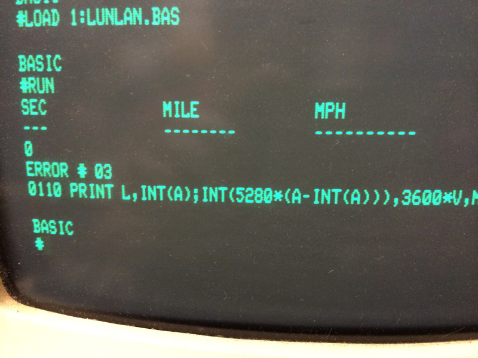

```
C-FOCAL,1969
```

# lunar-lander.js

The original Lunar Lander from 1969 by Jim Storer. Translated, for fun, for use in the web browser. 

Play it live here:

https://blackchip.org/lunar-lander

## References

Original source code obtained from:

https://www.cs.brandeis.edu/~storer/LunarLander/LunarLander.html

FOCAL Programming Manual was obtained from: 

http://www.bitsavers.org/www.computer.museum.uq.edu.au/pdf/DEC-08-AJAB-D%20PDP-8-I%20FOCAL%20Programming%20Manual.pdf

I found some helpful hints in the C version here:

https://www.cs.brandeis.edu/~storer/LunarLander/LunarLanderTranslations/LunarLanderJohnsonTranslation-c.txt

The beautiful Glass TTY VT220 font is from:

https://github.com/svofski/glasstty

I planned on writing this a long time ago and finally got around to it. Between
the time I made the plans and the time I actually got it done, it appears that
Stefan Trenkel wrote one too:

https://github.com/strenkel/lunar

You can never have too many Lunar Landers!

## About

[](lunlan.jpg)

This game is the forever favorite and the one played the most by the members of
the Vintage Computer Club. We actually once played it on a real teletype
machine using paper that was as yellow as a banana. Unfortunately I could not
find a teletype for this version and I don't think there is yet an W3C
Recommendation for teletype devices. I instead used an old-school terminal
display that I had previously developed:

https://github.com/blackchip-org/retro-display

For optimal fun the original source was translated line by line, in all of its
goto glory, instead of being restructured into a modern form. I think I found
two bugs in the original source and have corrected them here. Or it is my lack
of expertise in the FOCAL programming language that makes me think they are
bugs. Otherwise, this version tries to adhere to the original as much as
possible. Future plans may include adding more precision errors.

I wanted to add a typing effect to the display but this is JavaScript. To
add a short sleep between characters requires restructuring the whole 
program. They don't make them like they used to.

Open the web console in the browser if you would like to see the execution 
trace of the FOCAL commands and the state of the variables as they change. 

Use the following query string parameters to "cheat": 

- `a`: altitude
- `l`: elapsed time
- `f`: remaining fuel 
- `v`: velocity

Example: https://blackchip.org/lunar-lander/?l=220&a=0.0001&v=0.01&f=300

Input values are not checked. 

THIS GAME IS PROVIDED "AS-IS", WITHOUT WARRANTY OF ANY KIND, EXPRESS OR
IMPLIED, INCLUDING BUT NOT LIMITED TO LOSS OF OXYGEN, LOSS OF SPACE VEHICLE,
AND LIABILITY DUE TO DAMAGES INCURRED DURING SURFACE IMPACT.

## Development 

If you really want to start a web server and run the game locally:

```
npm install
npx ws
```

But this is application is old-school like the game itself. You can actually
open the index.html directly in the browser and it should work.

## License

Any assets in the repository that are *not* from the sources listed above are
placed under the MIT license.
